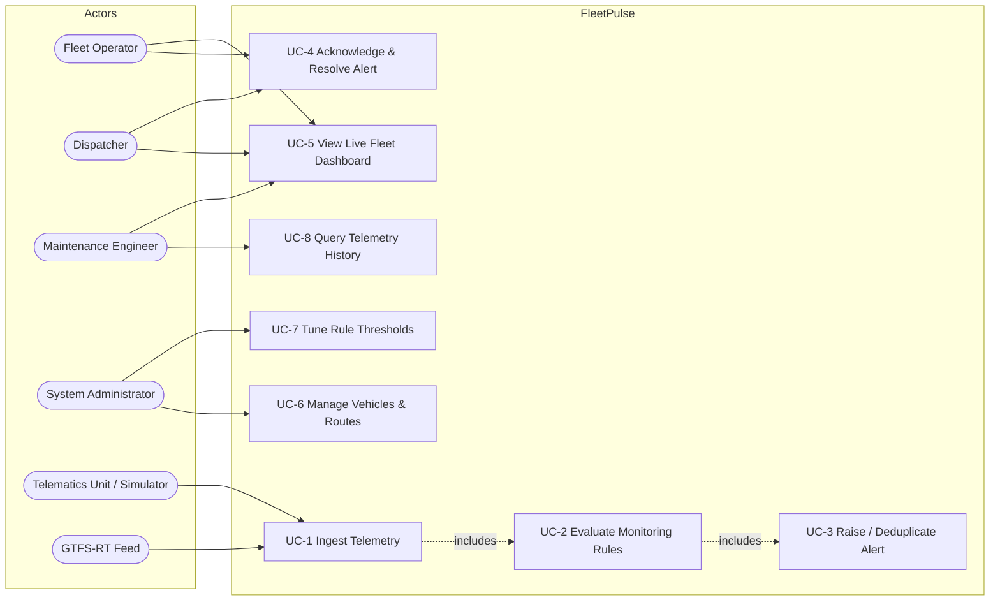

# Phase 1 — Requirements, User Stories, Use Cases & Acceptance Criteria

**Project:** FleetPulse · **Student:** Hafsa Aqeel (53317)
**Generated by AI prompts:** P-06, P-07, P-08 (see `PROMPT_LOG.md`), then reviewed and edited manually.

---

## 1. Functional Requirements

Priority uses MoSCoW: **M** = Must, **S** = Should, **C** = Could.

### 1.1 Vehicle Registry

| ID | Requirement | Pri | Testable via |
|----|-------------|-----|--------------|
| FR-01 | The system shall register a vehicle with a unique external code, a display label, and a type of either `bus` or `truck`. | M | `POST /api/vehicles` returns 201 and the vehicle is retrievable. |
| FR-02 | The system shall reject a vehicle whose external code duplicates an existing vehicle. | M | Second `POST` with the same code returns 409. |
| FR-03 | The system shall allow a vehicle to be assigned to at most one route at a time. | M | `PATCH /api/vehicles/{id}` with `route_id`; snapshot shows the route. |
| FR-04 | The system shall record, per vehicle, an operational status of `active`, `maintenance` or `retired`, and shall not evaluate rules for non-active vehicles. | S | Rules skipped for a `maintenance` vehicle. |

### 1.2 Route & Geofence Definition

| ID | Requirement | Pri | Testable via |
|----|-------------|-----|--------------|
| FR-05 | The system shall store a route as an ordered polyline of waypoints (latitude, longitude, sequence). | M | `POST /api/routes` with waypoints; `GET` returns them in sequence order. |
| FR-06 | A route shall carry a corridor half-width in metres defining the permitted deviation geofence. | M | Deviation rule uses the route's own corridor width. |
| FR-07 | A route shall carry a speed limit in km/h used by the overspeed rule. | M | Overspeed rule reads the route limit, not a global constant. |
| FR-08 | A bus route shall optionally carry timetabled stops with a scheduled offset in seconds from route start. | S | Schedule-delay rule reads stop offsets. |

### 1.3 Telemetry Ingestion

| ID | Requirement | Pri | Testable via |
|----|-------------|-----|--------------|
| FR-09 | The system shall accept a telemetry reading containing vehicle code, timestamp, latitude, longitude, speed, and optional engine temperature, fuel percentage, cargo temperature and odometer. | M | `POST /api/telemetry` returns 202 with the evaluation result. |
| FR-10 | The system shall accept a batch of up to 500 readings in one request. | S | `POST /api/telemetry/batch` with 500 items succeeds; 501 items returns 422. |
| FR-11 | The system shall reject readings with out-of-range coordinates, negative speed, or an unknown vehicle code. | M | Returns 422 / 404 respectively. |
| FR-12 | The system shall persist every accepted reading and expose it as time-ordered history for a vehicle. | M | `GET /api/vehicles/{id}/telemetry?limit=n`. |
| FR-13 | Ingestion shall be idempotent for an identical `(vehicle, timestamp)` pair — a repeat shall not create a duplicate row. | S | Re-POST the same reading; history length unchanged. |

### 1.4 Monitoring Rule Engine

| ID | Rule | Applies to | Pri |
|----|------|-----------|-----|
| FR-14 | **Overspeed** — speed exceeds the route speed limit by more than the configured tolerance. | both | M |
| FR-15 | **Engine overheating** — engine temperature above the warning threshold (`critical` above the critical threshold). | both | M |
| FR-16 | **Low fuel** — fuel percentage below the low threshold (`critical` below the critical threshold). | both | M |
| FR-17 | **Route deviation** — perpendicular distance from the route polyline exceeds the corridor half-width. | both | M |
| FR-18 | **Vehicle offline** — no telemetry received for longer than the heartbeat timeout. | both | M |
| FR-19 | **Harsh braking** — speed drop between consecutive readings exceeds the configured deceleration threshold. | both | S |
| FR-20 | **Schedule delay** — projected arrival at the next stop is later than its scheduled offset by more than the grace period. | bus only | S |
| FR-21 | **Cargo temperature excursion** — cargo temperature outside the vehicle's permitted band. | truck only | S |
| FR-22 | Every threshold in FR-14…FR-21 shall be configurable at runtime without a code change. | M | `PUT /api/config/thresholds` then behaviour changes. |
| FR-23 | Rule evaluation shall be a pure function of `(reading, vehicle context, thresholds)` with no I/O. | M | Rules unit-tested with no database. |

### 1.5 Alert Lifecycle

| ID | Requirement | Pri | Testable via |
|----|-------------|-----|--------------|
| FR-24 | An alert shall record vehicle, rule code, severity (`info`/`warning`/`critical`), human-readable message, measured value, threshold, and raised timestamp. | M | Alert JSON shape. |
| FR-25 | Repeated firings of the same rule for the same vehicle within the cooldown window shall increment an occurrence counter on the open alert instead of creating a new alert. | M | Two firings → one alert with `occurrences == 2`. |
| FR-26 | An alert shall move `open → acknowledged → resolved`; any other transition shall be rejected with 409. | M | `POST .../acknowledge`, `.../resolve`. |
| FR-27 | Resolving an alert shall record the resolution timestamp and compute its open duration. | S | `resolved_at` and `duration_seconds` present. |
| FR-28 | Alerts shall be listable filtered by vehicle, severity, status and time window, with pagination. | M | Query parameters on `GET /api/alerts`. |

### 1.6 Dashboard & Live Updates

| ID | Requirement | Pri | Testable via |
|----|-------------|-----|--------------|
| FR-29 | The system shall expose a fleet snapshot giving every active vehicle's last known position, speed, health state and open alert count. | M | `GET /api/fleet/snapshot`. |
| FR-30 | The system shall push fleet updates and newly raised alerts to connected clients over a WebSocket. | M | `/ws/live` receives a message after ingestion. |
| FR-31 | The SPA shall fall back to polling the snapshot endpoint if the WebSocket is unavailable. | S | Hook behaviour. |
| FR-32 | The SPA shall render a live map, KPI tiles, an alert feed, a vehicle table and a per-vehicle detail view with telemetry charts. | M | Manual/demo verification. |

### 1.7 Simulator & External Feed

| ID | Requirement | Pri | Testable via |
|----|-------------|-----|--------------|
| FR-33 | A simulator shall drive buses along their route polylines and trucks along delivery legs, emitting telemetry at a configurable interval. | M | Simulator step produces valid readings. |
| FR-34 | The simulator shall be deterministic given a seed. | M | Same seed → identical reading sequence. |
| FR-35 | The simulator shall inject named fault scenarios: `overheat`, `fuel_drain`, `deviation`, `dropout`, `cargo_spike`. | M | Scenario triggers the matching alert. |
| FR-36 | An optional GTFS-Realtime reader shall map `VehiclePosition` entities to FleetPulse telemetry. | C | Unit test with a stubbed feed object. |
| FR-37 | Absence of the GTFS protobuf dependency or an unreachable feed shall degrade gracefully with a clear error, never crashing the service. | C | Import guard test. |

---

## 2. Non-Functional Requirements

| ID | Requirement | Target |
|----|-------------|--------|
| NFR-01 | **Latency** — telemetry ingestion to alert visible on the dashboard. | < 2 s at 100 vehicles × 1 reading/5 s |
| NFR-02 | **Throughput** — sustained ingestion rate on a single node. | ≥ 200 readings/s |
| NFR-03 | **Testability** — statement coverage of the rule engine. | ≥ 90% |
| NFR-04 | **Portability** — runs on macOS, Linux and Windows with Python ≥ 3.11 and no external services. | SQLite default |
| NFR-05 | **Configurability** — all thresholds and intervals settable via environment variables or the config API. | no code edits |
| NFR-06 | **Observability** — `/api/health` reports database connectivity, uptime and ingestion counters. | — |
| NFR-07 | **Accessibility** — severity conveyed by icon and label as well as colour; contrast ≥ 4.5:1. | WCAG 2.1 AA |
| NFR-08 | **Data retention** — telemetry older than the retention window is prunable by a maintenance endpoint. | default 7 days |
| NFR-09 | **Resilience** — a failing rule shall not abort evaluation of the remaining rules for that reading. | isolated per rule |
| NFR-10 | **Reproducibility** — a seeded demo dataset can be recreated with one command. | `python -m app.seed` |

---

## 3. User Stories with Acceptance Criteria

Each story maps back to the functional requirements it realises.

### Epic A — Fleet Operator: see the fleet

**US-01** *(FR-29, FR-30, FR-32)*
> **As a** Fleet Operator, **I want** to see every active vehicle's live position and health on one
> screen, **so that** I can judge the state of the whole fleet at a glance.

- **Given** three active vehicles have reported telemetry, **when** I open the dashboard, **then** the
  map shows three markers positioned at their last reported coordinates.
- **Given** a vehicle has an open `critical` alert, **when** the fleet snapshot is rendered, **then**
  that vehicle's marker and table row are shown in the `critical` state with a text label, not colour alone.
- **Given** the dashboard is open, **when** new telemetry is ingested for a visible vehicle, **then**
  its marker position updates within 2 seconds without a manual refresh.

**US-02** *(FR-18, FR-30)*
> **As a** Fleet Operator, **I want** to be told when a vehicle stops reporting, **so that** I can
> investigate a possible breakdown or telematics failure.

- **Given** a vehicle's last reading is older than the heartbeat timeout, **when** the offline sweep
  runs, **then** a `VEHICLE_OFFLINE` alert of severity `critical` exists for that vehicle.
- **Given** an offline vehicle resumes reporting, **when** the next reading is ingested, **then** the
  open `VEHICLE_OFFLINE` alert is auto-resolved and its `resolved_at` is set.

### Epic B — Dispatcher: keep services on plan

**US-03** *(FR-17, FR-05, FR-06)*
> **As a** Dispatcher, **I want** an alert when a vehicle leaves its assigned corridor, **so that** I
> can contact the driver before the detour affects customers.

- **Given** a route with a 150 m corridor half-width, **when** a reading is 149 m from the polyline,
  **then** no deviation alert is raised.
- **Given** the same route, **when** a reading is 151 m from the polyline, **then** a
  `ROUTE_DEVIATION` alert is raised whose `measured_value` is the computed distance in metres.
- **Given** a vehicle with no assigned route, **when** telemetry is ingested, **then** the deviation
  rule is skipped and no error is raised.

**US-04** *(FR-20)*
> **As a** Dispatcher, **I want** to know which **buses** are running late, **so that** I can adjust
> the timetable or dispatch a relief bus.

- **Given** a bus whose projected arrival at the next stop exceeds the scheduled offset by more than
  the grace period, **when** telemetry is ingested, **then** a `SCHEDULE_DELAY` alert is raised.
- **Given** a **truck** with the same numbers, **when** telemetry is ingested, **then** no
  `SCHEDULE_DELAY` alert is raised — the rule is bus-gated.

### Epic C — Maintenance Engineer: catch failures early

**US-05** *(FR-15, FR-16, FR-19)*
> **As a** Maintenance Engineer, **I want** mechanical warnings before a breakdown, **so that** I can
> schedule service instead of recovering a stranded vehicle.

- **Given** the warning threshold is 105 °C and the critical threshold 115 °C, **when** a reading of
  110 °C arrives, **then** an `ENGINE_OVERHEAT` alert of severity `warning` is raised.
- **Given** the same thresholds, **when** a reading of 116 °C arrives, **then** the severity is `critical`.
- **Given** engine temperature is absent from the reading, **when** it is ingested, **then** the
  overheat rule is skipped and no alert or exception results.

**US-06** *(FR-21)*
> **As a** Maintenance Engineer, **I want** to know when a refrigerated **truck's** cargo leaves its
> temperature band, **so that** the load can be saved before it spoils.

- **Given** a truck with a permitted band of −20 °C…−15 °C, **when** cargo temperature reads −12 °C,
  **then** a `CARGO_TEMP_EXCURSION` alert is raised.
- **Given** a **bus** reporting a cargo temperature, **when** it is ingested, **then** the rule is skipped.

### Epic D — Operator: work the alert queue

**US-07** *(FR-25, FR-26, FR-27, FR-28)*
> **As a** Fleet Operator, **I want** to acknowledge and resolve alerts, **so that** my team knows
> which problems are already being handled.

- **Given** an `open` alert, **when** I acknowledge it, **then** its status becomes `acknowledged` and
  `acknowledged_at` is set.
- **Given** an `acknowledged` alert, **when** I resolve it, **then** its status becomes `resolved`,
  `resolved_at` is set and `duration_seconds` is positive.
- **Given** a `resolved` alert, **when** I acknowledge it, **then** the request is rejected with 409
  and the alert is unchanged.
- **Given** the same rule fires twice for the same vehicle inside the cooldown window, **when** I list
  alerts, **then** exactly one alert is present with `occurrences == 2`.

### Epic E — Administrator: tune without deploying

**US-08** *(FR-22, FR-01, FR-05)*
> **As a** System Administrator, **I want** to register vehicles and routes and tune thresholds from
> the UI, **so that** operational changes do not require a code deployment.

- **Given** the overspeed tolerance is 5 km/h, **when** I set it to 15 km/h via the threshold panel,
  **then** a reading 10 km/h over the limit no longer raises an alert.
- **Given** an existing vehicle code, **when** I register a second vehicle with that code, **then**
  the request fails with 409 and a message naming the conflicting code.

### Epic F — Demonstration: run without hardware

**US-09** *(FR-33, FR-34, FR-35)*
> **As a** student demonstrating the project, **I want** a seeded simulator with injectable faults,
> **so that** I can reproduce every alert type on demand in front of an examiner.

- **Given** seed 42, **when** the simulator runs twice for 20 steps, **then** both runs emit an
  identical sequence of readings.
- **Given** the `overheat` scenario is armed for vehicle `BUS-01`, **when** the simulator runs,
  **then** an `ENGINE_OVERHEAT` alert appears for `BUS-01` within the scenario's ramp window.

---

## 4. Use Case Specifications

### 4.1 Use Case Diagram

### 4.2 UC-1 — Ingest Telemetry

| Field | Value |
|---|---|
| **Primary actor** | Telematics unit (or the simulator / GTFS reader acting on its behalf) |
| **Stakeholders** | Operator wants fresh data; Engineer wants nothing lost |
| **Preconditions** | The vehicle code is registered and the service is running |
| **Trigger** | `POST /api/telemetry` |

**Main success scenario**
1. The client submits a reading with vehicle code, timestamp, position and sensor values.
2. The system validates the payload shape and coordinate ranges.
3. The system resolves the vehicle and rejects unknown codes.
4. The system checks `(vehicle, timestamp)` idempotency and skips a duplicate.
5. The system persists the reading.
6. The system invokes **UC-2** with the reading and the vehicle context.
7. The system broadcasts the updated vehicle state on the WebSocket.
8. The system responds `202 Accepted` with the reading id and any alerts raised.

**Extensions**
- 2a. Latitude/longitude out of range, or speed negative → `422` with a field-level error; nothing persisted.
- 3a. Unknown vehicle code → `404`; nothing persisted.
- 4a. Duplicate `(vehicle, timestamp)` → `202` with `duplicate: true`; no new row, no re-evaluation.
- 6a. A rule raises an exception → that rule is recorded as failed, the remaining rules still run *(NFR-09)*.
- 7a. No WebSocket clients connected → broadcast is a no-op.

**Postconditions** The reading is stored, zero or more alerts exist, connected clients have been notified.

### 4.3 UC-2 — Evaluate Monitoring Rules

| Field | Value |
|---|---|
| **Primary actor** | System (invoked by UC-1) |
| **Preconditions** | A validated reading and its vehicle context are in memory |

**Main success scenario**
1. The system loads the active threshold configuration.
2. The system builds an evaluation context: vehicle, assigned route, previous reading, thresholds.
3. The system filters the rule set to those applicable to the vehicle's type.
4. Each rule is invoked as a pure function returning zero or more alert candidates.
5. Candidates are returned to UC-1 for persistence via **UC-3**.

**Extensions**
- 2a. The vehicle has no assigned route → route-dependent rules (overspeed limit, deviation, schedule) are skipped.
- 2b. No previous reading exists → the harsh-braking rule is skipped.
- 3a. Vehicle status is not `active` → no rules run at all *(FR-04)*.
- 4a. A required sensor field is `None` → that rule returns no candidates rather than failing.

**Postconditions** A list of alert candidates, each carrying rule code, severity, message, measured value and threshold.

### 4.4 UC-3 — Raise and Deduplicate an Alert

| Field | Value |
|---|---|
| **Primary actor** | System |
| **Preconditions** | At least one alert candidate exists |

**Main success scenario**
1. For each candidate, the system searches for an open or acknowledged alert with the same vehicle and rule code raised within the cooldown window.
2. If none is found, a new alert is created with `occurrences = 1`.
3. If one is found, its `occurrences` is incremented, `last_seen_at` updated, and severity escalated if the new candidate is more severe.
4. New alerts are broadcast on the WebSocket.

**Extensions**
- 3a. The existing alert is `resolved` → it is not reused; a fresh alert is created.
- 3b. The new candidate is *less* severe than the existing alert → severity is not downgraded.

**Postconditions** The alert set reflects the candidates without duplicate storms.

### 4.5 UC-4 — Acknowledge and Resolve an Alert

| Field | Value |
|---|---|
| **Primary actor** | Fleet Operator / Dispatcher |
| **Preconditions** | The alert exists |

**Main success scenario**
1. The operator selects an alert in the alert feed.
2. The operator acknowledges it; the system sets `status = acknowledged` and stamps `acknowledged_at`.
3. After handling, the operator resolves it; the system sets `status = resolved`, stamps `resolved_at` and computes `duration_seconds`.
4. The alert leaves the default open-alert view.

**Extensions**
- 2a. The alert is already `resolved` → `409 Conflict`, state unchanged.
- 3a. The alert is still `open` → resolving directly is permitted (`open → resolved` is a legal shortcut); acknowledging a resolved alert is not.
- 3b. The alert id does not exist → `404`.

**Postconditions** Alert status reflects operator action and is auditable through its timestamps.

### 4.6 UC-5 — View the Live Fleet Dashboard

| Field | Value |
|---|---|
| **Primary actor** | Fleet Operator |
| **Preconditions** | The SPA is served and the API is reachable |

**Main success scenario**
1. The SPA requests `GET /api/fleet/snapshot` and renders map markers, KPI tiles, the vehicle table and the alert feed.
2. The SPA opens `/ws/live`.
3. On each `vehicle_update` message the affected marker and row are updated in place.
4. On each `alert_raised` message the alert feed prepends the alert and the KPI counters increment.
5. Selecting a vehicle opens the detail view and loads its telemetry history charts.

**Extensions**
- 2a. The WebSocket fails to open or drops → the SPA falls back to polling the snapshot every 5 s and shows a degraded-connection indicator *(FR-31)*.
- 5a. The vehicle has no history → the charts render an explicit empty state rather than a blank panel.

**Postconditions** The operator's view reflects server state within the latency budget *(NFR-01)*.

---

## 5. Requirements Traceability Matrix

| Requirement | User story | Use case | Implementation | Test |
|---|---|---|---|---|
| FR-01, FR-02 | US-08 | UC-6 | `routers/vehicles.py` | `test_api_vehicles.py` |
| FR-05…FR-08 | US-03, US-08 | UC-6 | `routers/routes.py` | `test_api_routes.py` |
| FR-09…FR-13 | US-01 | UC-1 | `routers/telemetry.py` | `test_api_telemetry.py` |
| FR-14 | US-03 | UC-2 | `rules/overspeed.py` | `test_rules_overspeed.py` |
| FR-15 | US-05 | UC-2 | `rules/engine_temp.py` | `test_rules_engine_temp.py` |
| FR-16 | US-05 | UC-2 | `rules/fuel.py` | `test_rules_fuel.py` |
| FR-17 | US-03 | UC-2 | `rules/deviation.py` | `test_rules_deviation.py` |
| FR-18 | US-02 | UC-2 | `rules/offline.py` | `test_rules_offline.py` |
| FR-19 | US-05 | UC-2 | `rules/harsh_braking.py` | `test_rules_harsh_braking.py` |
| FR-20 | US-04 | UC-2 | `rules/schedule.py` | `test_rules_schedule.py` |
| FR-21 | US-06 | UC-2 | `rules/cargo_temp.py` | `test_rules_cargo_temp.py` |
| FR-22 | US-08 | UC-7 | `routers/config.py` | `test_api_config.py` |
| FR-24…FR-28 | US-07 | UC-3, UC-4 | `routers/alerts.py`, `services/alerts.py` | `test_api_alerts.py` |
| FR-29…FR-31 | US-01 | UC-5 | `routers/fleet.py`, `main.py` | `test_api_fleet.py`, `test_ws_live.py` |
| FR-33…FR-35 | US-09 | — | `services/simulator.py` | `test_simulator.py` |
| FR-36, FR-37 | — | UC-1 | `services/gtfs.py` | `test_gtfs.py` |
