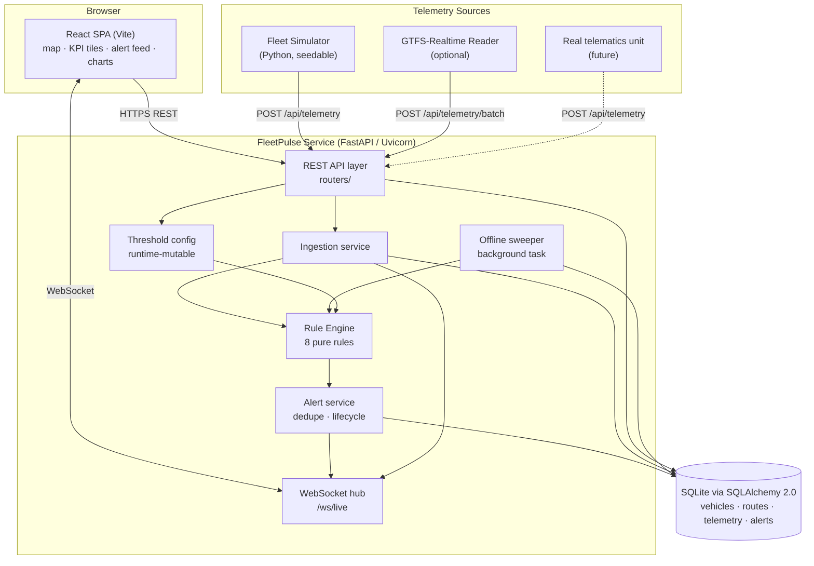
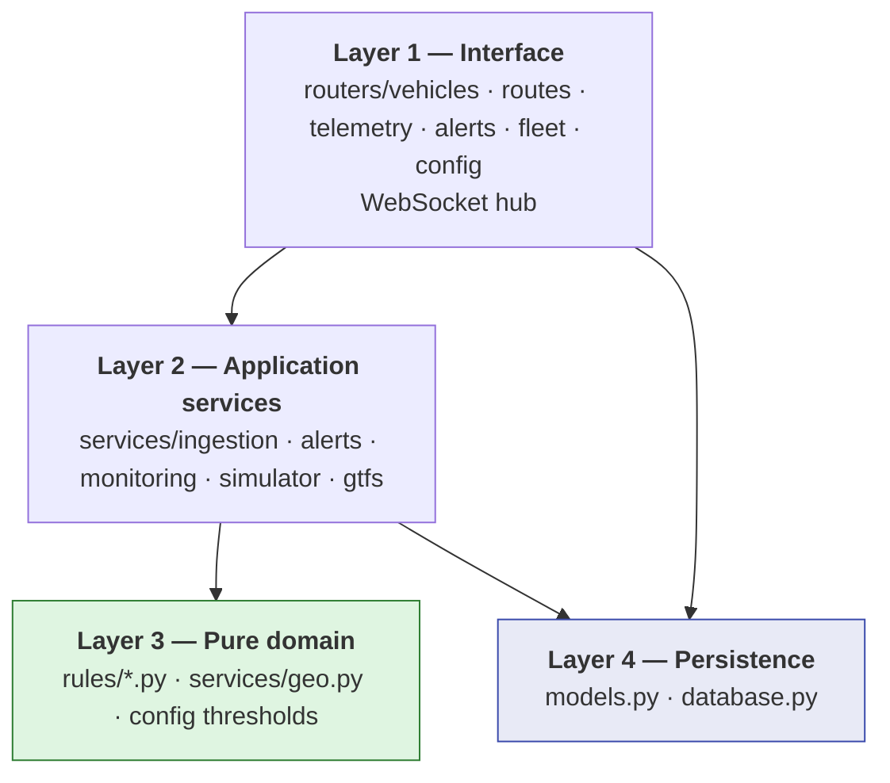
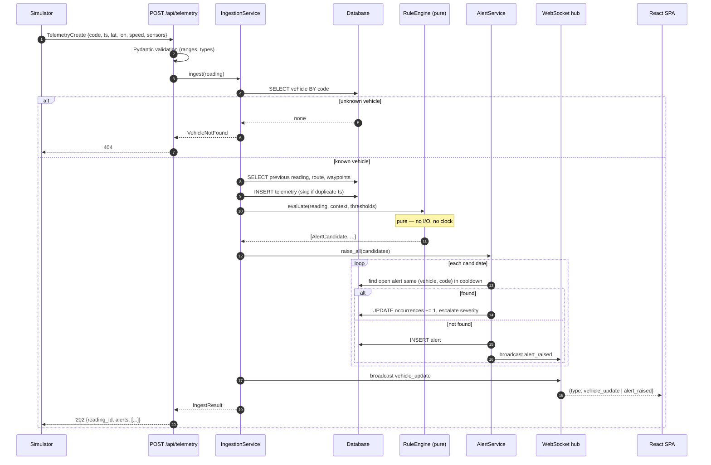
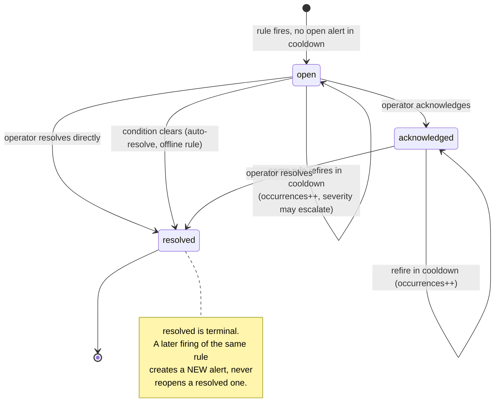
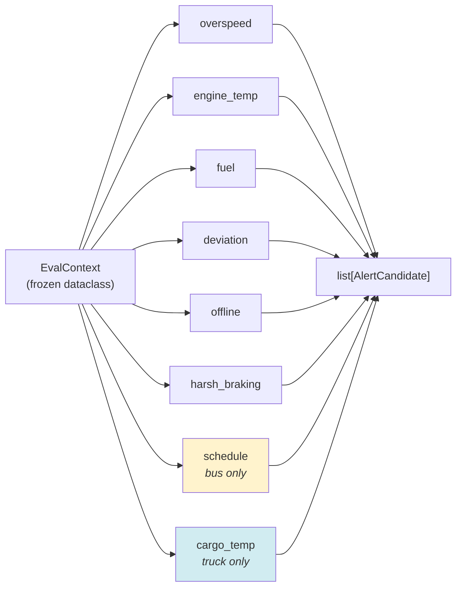
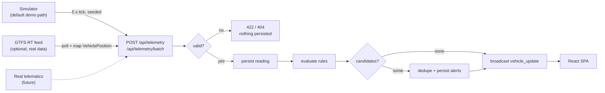
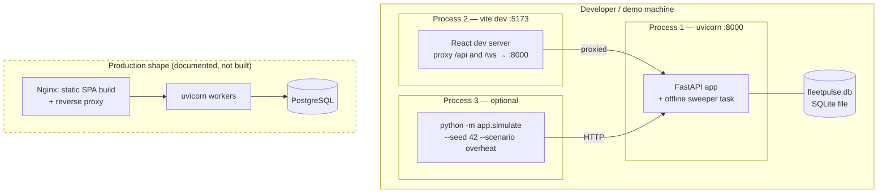

# Phase 2 — System Architecture

**Project:** FleetPulse · **Student:** Hafsa Aqeel (53317)
**Generated by AI prompt:** P-09 (see `PROMPT_LOG.md`), reviewed and edited manually.

---

## 1. Architectural Overview

FleetPulse is a **single-process, layered, event-driven monitoring service** with a decoupled
single-page front end. Telemetry enters through one narrow ingestion port, is evaluated by a pure
rule engine, produces alerts through a deduplicating alert service, and is fanned out to browsers
over a WebSocket hub.

The governing principle is **a pure core with I/O at the edges**. Everything that decides *whether
something is wrong* is a pure function; everything that touches a database, a socket or the clock
lives in a thin outer layer. This is a direct consequence of the mandatory AI constraint — the rule
engine had to be trivially unit-testable so AI could generate meaningful tests for it without
mocking a database.

---

## 2. Container Diagram (C4 Level 2)



### Container responsibilities

| Container | Responsibility | Explicitly *not* responsible for |
|---|---|---|
| **React SPA** | Presentation, user interaction, live rendering | Any rule logic or threshold defaults |
| **REST API layer** | HTTP contract, validation, serialisation, status codes | Deciding whether a reading is anomalous |
| **Ingestion service** | Persist reading, orchestrate evaluation, trigger broadcast | Formulating alert text |
| **Rule engine** | Decide, from a reading + context + thresholds, what is wrong | Database, clock, network |
| **Alert service** | Deduplication window, occurrence counting, severity escalation, lifecycle transitions | Rule semantics |
| **Offline sweeper** | Periodically detect vehicles past the heartbeat timeout | Any other rule |
| **WebSocket hub** | Client registry and fan-out, dead-client pruning | Business decisions |
| **Simulator / GTFS reader** | Produce realistic or real telemetry | Anything inside the service |

---

## 3. Layered Module View



**Dependency rule:** Layer 3 imports nothing from Layers 1, 2 or 4. It is the only layer with no
`import` of SQLAlchemy, FastAPI, `datetime.now()` or `random`. Every value it needs — including the
evaluation timestamp — is passed in. That property is what makes the AI-generated tests in
`backend/tests/test_rules_*.py` possible without a single mock.

---

## 4. Telemetry-to-Alert Sequence



---

## 5. Alert Lifecycle State Machine



Rejected transitions return **409 Conflict**: `resolved → acknowledged`, `resolved → open`,
`acknowledged → open`.

---

## 6. Rule Engine Design

Every rule implements the same signature:

```python
def rule_name(ctx: EvalContext) -> list[AlertCandidate]: ...
```

`EvalContext` is a frozen dataclass carrying the current reading, the previous reading (or `None`),
the vehicle, its route with waypoints (or `None`), and the threshold set. Rules are registered in a
list with a declared `applies_to` vehicle-type set, so gating is data, not `if` statements scattered
through the engine.



**Isolation guarantee (NFR-09):** the engine wraps each rule call in a `try/except`; a raising rule is
recorded in `failed_rules` on the result and the remaining rules still execute. A bug in the cargo
rule can never suppress an overheating alert.

---

## 7. Key Design Decisions and Rejected Alternatives

| # | Decision | Why | Rejected alternative | Why rejected |
|---|---|---|---|---|
| D-1 | Pure-function rule engine with injected thresholds and injected `now` | Makes AI test generation possible with zero mocks; satisfies the Python constraint at the architecture level | Rules as methods on an ORM `Vehicle` model | Every test would need a live database session; AI-generated tests would be brittle and slow |
| D-2 | SQLite + SQLAlchemy 2.0, Postgres-compatible schema | Zero-setup demo on any examiner's machine (NFR-04) while keeping a migration path | PostgreSQL + TimescaleDB | Correct for production scale, but makes the demo dependent on a running server |
| D-3 | Deduplication by cooldown window with occurrence counting | Prevents the alert storm a 5-second telemetry interval would otherwise produce (one alert per reading) | Raise an alert per firing | Unusable UI: a single overheating bus would emit 720 alerts an hour |
| D-4 | WebSocket push with polling fallback | Meets the 2-second latency budget (NFR-01) without hammering the API; the fallback keeps the demo working behind restrictive proxies | Polling only | Either high latency or high load; misses the "live" quality the dashboard needs |
| D-5 | Simulator as a first-class in-repo component | Makes the whole system demonstrable and, crucially, **deterministic under a seed** so tests can assert on it | Recorded CSV fixture replay | Cannot inject faults interactively during the demo |
| D-6 | GTFS-Realtime reader behind an optional import guard | Gives a real-data story without making `gtfs-realtime-bindings` a hard dependency | Hard dependency | An unavailable protobuf wheel would break installation on the examiner's machine (NFR-04) |
| D-7 | Offline detection as a periodic sweeper, not an ingestion-time rule | "No data arrived" is by definition not observable from an arriving reading | Check staleness when the *next* reading arrives | A permanently dead vehicle would never be reported — the exact case that matters |
| D-8 | Single-process deployment | Matches the scale target (NFR-02, hundreds of vehicles) and keeps the demo one command | Message broker (Kafka/Redis) between ingestion and evaluation | Operationally heavy, unjustified at this scale, would obscure the SDLC narrative |
| D-9 | No authentication | Explicitly out of scope; called out as the first item of future work | Bolt on JWT auth | Would consume project time without exercising the Transportation/Monitoring/testing theme |

---

## 8. Data Flow: the three ingestion paths



---

## 9. Deployment View



**Demo topology:** two processes (API + Vite), one optional third (simulator). No broker, no
container runtime, no cloud account required.

---

## 10. Quality Attribute Tactics

| Attribute | Tactic used |
|---|---|
| **Testability (NFR-03)** | Purity of Layer 3; injected clock; injected thresholds; dataclass context object |
| **Latency (NFR-01)** | Evaluate synchronously in the request path (rules are microseconds); push rather than poll |
| **Throughput (NFR-02)** | Batch ingestion endpoint; indexed `(vehicle_id, recorded_at DESC)`; no per-reading table scan |
| **Resilience (NFR-09)** | Per-rule exception isolation; WebSocket send failures prune the client instead of aborting ingestion |
| **Configurability (NFR-05)** | Thresholds in a single settings object, overridable by env var and by `PUT /api/config/thresholds` |
| **Portability (NFR-04)** | Pure-Python dependency set; SQLite default; optional deps behind import guards |
| **Observability (NFR-06)** | `/api/health` with DB check, uptime and ingestion counters; `/api/stats` for fleet aggregates |
| **Data growth (NFR-08)** | `DELETE /api/maintenance/prune?older_than_days=n` |
