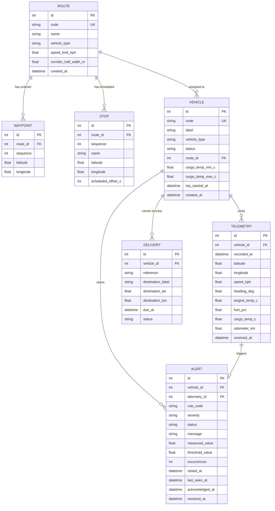

# Phase 2 — Database Design

**Project:** FleetPulse · **Student:** Hafsa Aqeel (53317)
**Generated by AI prompt:** P-10 (see `PROMPT_LOG.md`), reviewed and edited manually.

---

## 1. Entity Relationship Diagram

---

## 2. Table Definitions

### 2.1 `routes`

| Column | Type | Constraints | Notes |
|---|---|---|---|
| `id` | INTEGER | PK, autoincrement | |
| `code` | VARCHAR(32) | NOT NULL, UNIQUE | e.g. `R-11A`, `TRK-NORTH` |
| `name` | VARCHAR(120) | NOT NULL | Human label |
| `vehicle_type` | VARCHAR(8) | NOT NULL, CHECK in (`bus`,`truck`) | A route serves one fleet type |
| `speed_limit_kph` | FLOAT | NOT NULL, DEFAULT 60, CHECK > 0 | Used by the overspeed rule (FR-07) |
| `corridor_half_width_m` | FLOAT | NOT NULL, DEFAULT 150, CHECK > 0 | Geofence tolerance (FR-06) |
| `created_at` | DATETIME | NOT NULL, UTC | |

### 2.2 `waypoints`

| Column | Type | Constraints | Notes |
|---|---|---|---|
| `id` | INTEGER | PK | |
| `route_id` | INTEGER | FK → `routes.id`, ON DELETE CASCADE, NOT NULL | |
| `sequence` | INTEGER | NOT NULL | Ordering along the polyline |
| `latitude` | FLOAT | NOT NULL, CHECK −90…90 | |
| `longitude` | FLOAT | NOT NULL, CHECK −180…180 | |

**Constraint:** `UNIQUE(route_id, sequence)` — no two waypoints share a position in the ordering.

### 2.3 `stops` *(bus routes)*

| Column | Type | Constraints | Notes |
|---|---|---|---|
| `id` | INTEGER | PK | |
| `route_id` | INTEGER | FK → `routes.id`, CASCADE, NOT NULL | |
| `sequence` | INTEGER | NOT NULL | |
| `name` | VARCHAR(120) | NOT NULL | |
| `latitude`, `longitude` | FLOAT | NOT NULL, range-checked | |
| `scheduled_offset_s` | INTEGER | NOT NULL, CHECK ≥ 0 | Seconds from route start (FR-08) |

**Constraint:** `UNIQUE(route_id, sequence)`.

### 2.4 `vehicles`

| Column | Type | Constraints | Notes |
|---|---|---|---|
| `id` | INTEGER | PK | |
| `code` | VARCHAR(32) | NOT NULL, UNIQUE | e.g. `BUS-01`, `TRK-07` (FR-02) |
| `label` | VARCHAR(120) | NOT NULL | |
| `vehicle_type` | VARCHAR(8) | NOT NULL, CHECK in (`bus`,`truck`) | Drives rule gating |
| `status` | VARCHAR(16) | NOT NULL, DEFAULT `active`, CHECK in (`active`,`maintenance`,`retired`) | Non-active ⇒ no rule evaluation (FR-04) |
| `route_id` | INTEGER | FK → `routes.id`, ON DELETE SET NULL, NULLABLE | At most one route (FR-03) |
| `cargo_temp_min_c` | FLOAT | NULLABLE | Truck refrigeration band lower bound |
| `cargo_temp_max_c` | FLOAT | NULLABLE | Upper bound; both NULL ⇒ cargo rule skipped |
| `trip_started_at` | DATETIME | NULLABLE | Buses only. The origin that `stops.scheduled_offset_s` is measured from. Added during implementation: the schedule-delay rule (FR-20) needs a trip start to compare against, and the first draft of this schema had nowhere to put one. NULL ⇒ the rule is skipped. |
| `created_at` | DATETIME | NOT NULL, UTC | |

### 2.5 `telemetry` *(the time-series table)*

| Column | Type | Constraints | Notes |
|---|---|---|---|
| `id` | INTEGER | PK | |
| `vehicle_id` | INTEGER | FK → `vehicles.id`, CASCADE, NOT NULL | |
| `recorded_at` | DATETIME | NOT NULL, UTC | Device timestamp |
| `latitude` | FLOAT | NOT NULL, CHECK −90…90 | |
| `longitude` | FLOAT | NOT NULL, CHECK −180…180 | |
| `speed_kph` | FLOAT | NOT NULL, CHECK ≥ 0 | |
| `heading_deg` | FLOAT | NULLABLE, CHECK 0…360 | |
| `engine_temp_c` | FLOAT | NULLABLE | NULL ⇒ overheat rule skipped |
| `fuel_pct` | FLOAT | NULLABLE, CHECK 0…100 | |
| `cargo_temp_c` | FLOAT | NULLABLE | |
| `odometer_km` | FLOAT | NULLABLE, CHECK ≥ 0 | |
| `received_at` | DATETIME | NOT NULL, UTC | Server receipt time; `received_at − recorded_at` is the transport lag |

**Constraint:** `UNIQUE(vehicle_id, recorded_at)` — enforces ingestion idempotency (FR-13) at the
database level rather than relying on an application check that races under concurrency.

### 2.6 `alerts`

| Column | Type | Constraints | Notes |
|---|---|---|---|
| `id` | INTEGER | PK | |
| `vehicle_id` | INTEGER | FK → `vehicles.id`, CASCADE, NOT NULL | |
| `telemetry_id` | INTEGER | FK → `telemetry.id`, SET NULL, NULLABLE | The reading that triggered it; NULL for sweeper-raised offline alerts |
| `rule_code` | VARCHAR(32) | NOT NULL | `OVERSPEED`, `ENGINE_OVERHEAT`, … |
| `severity` | VARCHAR(8) | NOT NULL, CHECK in (`info`,`warning`,`critical`) | |
| `status` | VARCHAR(16) | NOT NULL, DEFAULT `open`, CHECK in (`open`,`acknowledged`,`resolved`) | |
| `message` | VARCHAR(255) | NOT NULL | Operator-facing text |
| `measured_value` | FLOAT | NULLABLE | What was observed |
| `threshold_value` | FLOAT | NULLABLE | What was permitted |
| `occurrences` | INTEGER | NOT NULL, DEFAULT 1 | Incremented on dedupe (FR-25) |
| `raised_at` | DATETIME | NOT NULL, UTC | |
| `last_seen_at` | DATETIME | NOT NULL, UTC | Updated on each dedupe hit |
| `acknowledged_at` | DATETIME | NULLABLE | |
| `resolved_at` | DATETIME | NULLABLE | |

`duration_seconds` is **derived**, not stored: `resolved_at − raised_at`. Storing it would create a
second source of truth that could drift.

### 2.7 `deliveries` *(trucks)*

| Column | Type | Constraints |
|---|---|---|
| `id` | INTEGER | PK |
| `vehicle_id` | INTEGER | FK → `vehicles.id`, CASCADE, NOT NULL |
| `reference` | VARCHAR(64) | NOT NULL |
| `destination_label` | VARCHAR(120) | NOT NULL |
| `destination_lat`, `destination_lon` | FLOAT | NOT NULL, range-checked |
| `due_at` | DATETIME | NOT NULL, UTC |
| `status` | VARCHAR(16) | NOT NULL, DEFAULT `pending`, CHECK in (`pending`,`delivered`,`failed`) |

---

## 3. Indexing Strategy

The dominant query is *"the last N readings for one vehicle, newest first"*, executed by the vehicle
detail charts and by the ingestion service to fetch the previous reading for the harsh-braking rule.

| Index | Columns | Serves |
|---|---|---|
| `ix_telemetry_vehicle_time` | `(vehicle_id, recorded_at DESC)` | Telemetry history (FR-12); previous-reading lookup on every ingest — the hottest query in the system |
| `uq_telemetry_vehicle_ts` | `(vehicle_id, recorded_at)` UNIQUE | Idempotency (FR-13) |
| `ix_alerts_status_severity` | `(status, severity)` | Default dashboard query: open alerts ranked by severity |
| `ix_alerts_vehicle_rule_status` | `(vehicle_id, rule_code, status)` | The deduplication lookup on every candidate (FR-25) |
| `ix_alerts_raised_at` | `(raised_at DESC)` | Alert feed ordering and time-window filters (FR-28) |
| `ix_vehicles_code` | `(code)` UNIQUE | Ingestion resolves a vehicle by code on every reading |
| `ix_waypoints_route_seq` | `(route_id, sequence)` UNIQUE | Polyline reconstruction in sequence order |

**Deliberately not indexed:** `telemetry.recorded_at` alone. Every real query is vehicle-scoped, so
the composite index already covers it; a second index would only slow inserts on the highest-write
table in the schema.

---

## 4. Retention and Growth

At the demo rate — 20 vehicles × 1 reading / 5 s — telemetry grows at ~345,600 rows/day
(~35 MB/day in SQLite). Unbounded growth would eventually degrade the history query, so:

- **Retention window:** 7 days by default (`FLEETPULSE_RETENTION_DAYS`).
- **Pruning:** `DELETE /api/maintenance/prune?older_than_days=n` deletes telemetry older than the
  window and returns the row count (NFR-08). Alerts are **never** auto-pruned — they are the
  operational audit trail.
- **Cascade safety:** `alerts.telemetry_id` is `ON DELETE SET NULL`, so pruning telemetry never
  destroys an alert record; the alert keeps its own `measured_value` snapshot.

That last point is the reason `measured_value` and `threshold_value` are copied onto the alert rather
than being joined from the triggering reading: an alert must remain fully interpretable after its
source telemetry has been pruned.

---

## 5. Normalisation Notes

The schema is in **third normal form**, with two conscious, documented denormalisations:

1. **`alerts.measured_value` / `threshold_value`** duplicate data derivable from the reading and the
   threshold config at raise time. Justified above: alerts must survive telemetry pruning and must
   record the threshold *as it was when the alert fired*, not as it is now — thresholds are runtime-mutable (FR-22).
2. **`alerts.occurrences`** is a counter rather than a child `alert_occurrence` table. A child table
   would be more normalised, but it would turn the hottest write path into an insert-per-reading —
   the exact alert-storm cost that deduplication exists to avoid (design decision D-3).

`vehicles.cargo_temp_min_c/max_c` are nullable columns on the shared table rather than a separate
`truck_profile` table. With exactly two vehicle types and two type-specific columns, single-table
inheritance is the proportionate choice; the cargo rule treats `NULL` bounds as "rule not applicable".

---

## 6. Seed Dataset

`python -m app.seed` creates a reproducible demo world:

| Entity | Count | Detail |
|---|---|---|
| Routes | 3 | `R-11A` and `R-22B` (bus, with 6 timetabled stops each), `TRK-NORTH` (truck) |
| Vehicles | 12 | 8 buses across the two bus routes, 4 refrigerated trucks on `TRK-NORTH` |
| Deliveries | 8 | 2 per truck, due within the demo window |
| Telemetry | 0 | Produced live by the simulator so the demo starts from a clean, explainable state |
