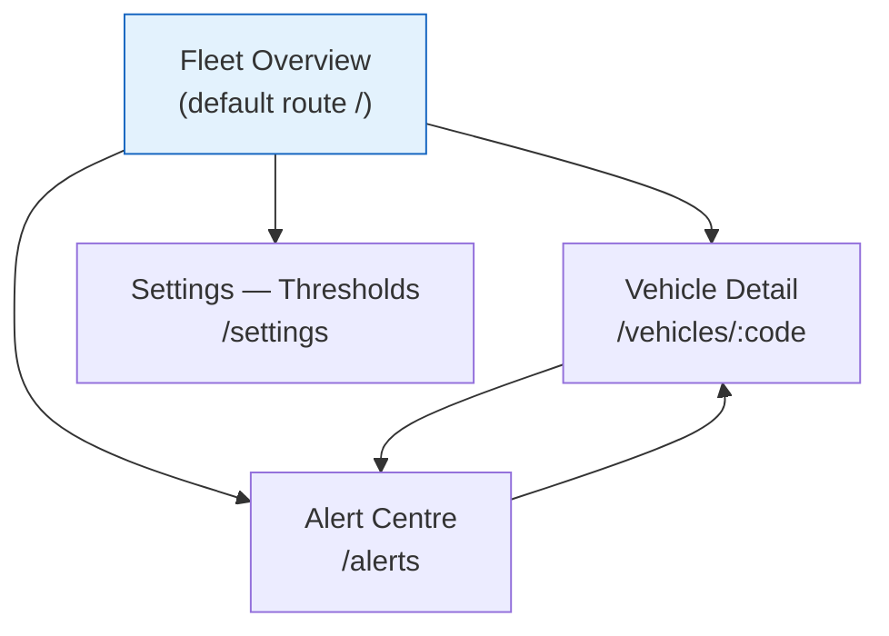
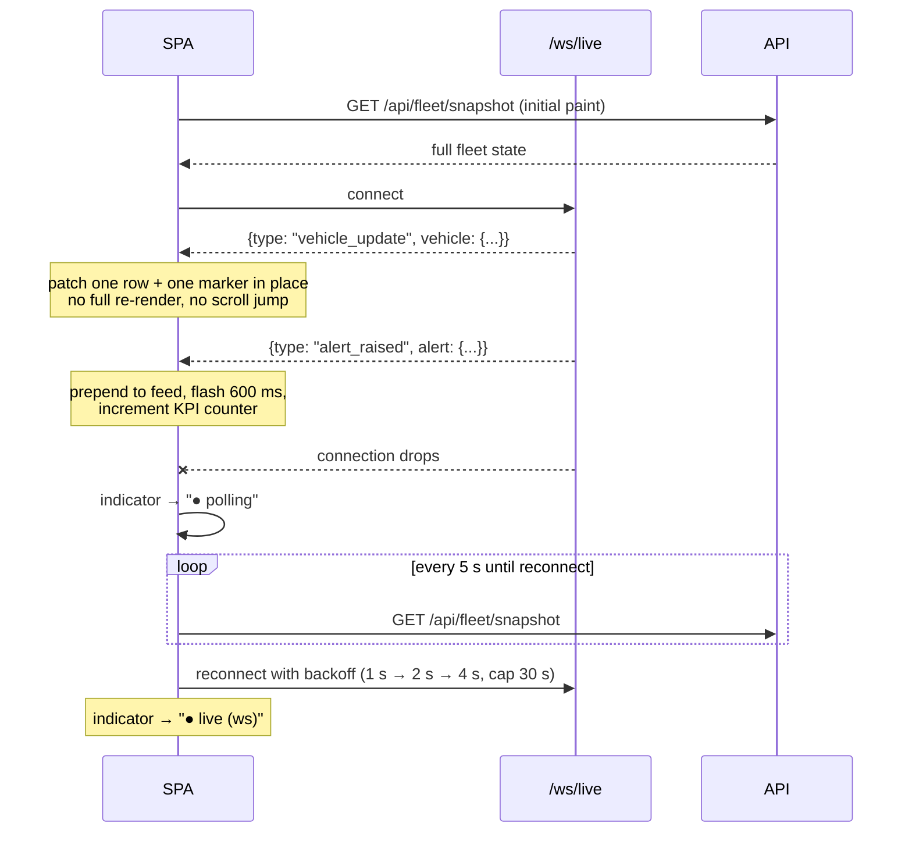
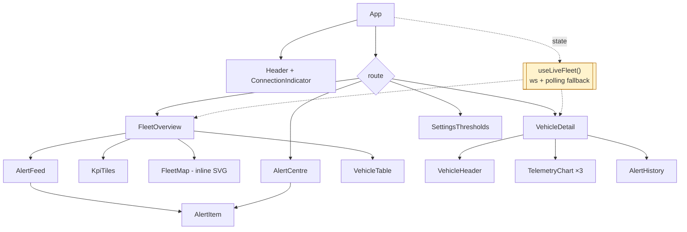

# Phase 2 — UI/UX Design

**Project:** FleetPulse · **Student:** Hafsa Aqeel (53317)
**Generated by AI prompt:** P-11 (see `PROMPT_LOG.md`), reviewed and edited manually.

---

## 1. Design Goal

The dashboard is a **control-room instrument**, not a marketing page. Its single job is to answer,
within about three seconds of a glance:

1. Is anything wrong right now?
2. Which vehicle, and how bad?
3. What do I do about it?

Everything else — historical charts, threshold tuning, registry management — is secondary and is
reachable in one click but never competes for attention with the alert state.

---

## 2. Information Architecture



Three screens plus a settings panel. Deliberately shallow: an operator under pressure should never
be more than one navigation step from the overview.

---

## 3. Screen 1 — Fleet Overview

```
┌────────────────────────────────────────────────────────────────────────────────┐
│  FleetPulse            ● live (ws)          Fleet Overview │ Alerts │ Settings │
├────────────────────────────────────────────────────────────────────────────────┤
│ ┌──────────────┐ ┌──────────────┐ ┌──────────────┐ ┌──────────────┐            │
│ │ VEHICLES     │ │ CRITICAL     │ │ WARNINGS     │ │ OFFLINE      │            │
│ │    12        │ │     2        │ │     5        │ │     1        │            │
│ │ 11 reporting │ │ ▲ needs act. │ │ ▲ monitor    │ │ ▲ no signal  │            │
│ └──────────────┘ └──────────────┘ └──────────────┘ └──────────────┘            │
├──────────────────────────────────────────┬─────────────────────────────────────┤
│                                          │  ALERT FEED            [All ▾]      │
│            LIVE FLEET MAP                │ ┌─────────────────────────────────┐ │
│                                          │ │ ⛔ CRITICAL  BUS-03      12:04  │ │
│      ▲BUS-01        ⛔BUS-03             │ │ Engine 118 °C (limit 115)  ×3   │ │
│                                          │ │ [Acknowledge]  [Resolve]        │ │
│           ●BUS-05     ▲TRK-02            │ ├─────────────────────────────────┤ │
│                                          │ │ ⚠ WARNING   TRK-02      12:03   │ │
│    ●BUS-02   ⛔TRK-04   ●BUS-07          │ │ Cargo −11.2 °C (max −15)   ×1   │ │
│                                          │ │ [Acknowledge]  [Resolve]        │ │
│   ─── route R-11A   ─── route TRK-NORTH  │ ├─────────────────────────────────┤ │
│                                          │ │ ⓘ INFO      BUS-05      12:01   │ │
│                                          │ │ Fuel 18% (low 20%)         ×1   │ │
│                                          │ └─────────────────────────────────┘ │
├──────────────────────────────────────────┴─────────────────────────────────────┤
│  VEHICLE TABLE                                    Filter: [all ▾] [bus] [truck]│
│  State    Code     Type   Route      Speed   Engine  Fuel   Last seen   Alerts │
│  ⛔ crit  BUS-03   bus    R-11A      42 kph  118 °C  64 %   2 s ago     3      │
│  ⚠ warn   TRK-02   truck  TRK-NORTH  67 kph   91 °C  55 %   4 s ago     1      │
│  ● ok     BUS-01   bus    R-11A      38 kph   88 °C  72 %   1 s ago     0      │
│  ○ offline BUS-08  bus    R-22B      —        —      —      6 m ago     1      │
└────────────────────────────────────────────────────────────────────────────────┘
```

**Layout rationale.** KPI tiles occupy the top band because "is anything wrong" is the first
question. The map and the alert feed share the primary band side by side — the map answers *where*,
the feed answers *what and how bad*, and an operator reads them together. The table is the
exhaustive fallback beneath the fold, sorted worst-state-first so scrolling is rarely needed.

---

## 4. Screen 2 — Vehicle Detail

```
┌────────────────────────────────────────────────────────────────────────────────┐
│  ← Fleet    BUS-03 · Bus 03 (Downtown)          ⛔ CRITICAL   route R-11A       │
├────────────────────────────────────────────────────────────────────────────────┤
│  Speed 42 kph   Engine 118 °C   Fuel 64 %   Odometer 84,120 km  Seen 2 s ago   │
├────────────────────────────────────────────────────────────────────────────────┤
│  ENGINE TEMPERATURE (last 60 readings)                                          │
│  125 ┤                                          ╭──────  ← critical 115         │
│  115 ┼ ─ ─ ─ ─ ─ ─ ─ ─ ─ ─ ─ ─ ─ ─ ─ ─ ─╭──────╯                                │
│  105 ┼ ─ ─ ─ ─ ─ ─ ─ ─ ─ ─ ─ ─ ─ ╭──────╯       ← warning 105                   │
│   95 ┤ ────────────────────────╯                                                │
│      └────────────────────────────────────────────────────────────────          │
│  SPEED (last 60 readings)              FUEL (last 60 readings)                  │
│  ┌──────────────────────────────┐      ┌──────────────────────────────┐        │
│  │      ╱╲    ╱╲___╱╲           │      │ ╲___                         │        │
│  │  ___╱  ╲__╱       ╲___       │      │     ╲______                  │        │
│  └──────────────────────────────┘      └──────────────────────────────┘        │
├────────────────────────────────────────────────────────────────────────────────┤
│  ALERT HISTORY FOR THIS VEHICLE                                                 │
│  ⛔ ENGINE_OVERHEAT   open          12:04  ×3   118 °C / 115 °C                 │
│  ⚠ OVERSPEED          resolved      11:47  ×1    68 kph / 60 kph   (4 m open)   │
└────────────────────────────────────────────────────────────────────────────────┘
```

Threshold lines are drawn **on** the charts. A temperature curve is meaningless without the limit it
is approaching; showing both turns the chart from a record into a prediction.

---

## 5. Screen 3 — Alert Centre

Full-width filterable table over all alerts, with the filters that match FR-28: vehicle, severity,
status and time window. Default view is `status = open, ORDER BY severity DESC, raised_at DESC` —
the queue an operator actually works. Bulk acknowledge is available for multi-select.

---

## 6. Settings — Threshold Panel

```
┌───────────────────────────────────────────────────────────┐
│  RULE THRESHOLDS                        [Reset defaults]  │
│  Overspeed tolerance          [  5 ] kph over route limit │
│  Engine warning               [105 ] °C                   │
│  Engine critical              [115 ] °C                   │
│  Fuel low                     [ 20 ] %                    │
│  Fuel critical                [ 10 ] %                    │
│  Harsh braking Δ              [ 25 ] kph between readings │
│  Heartbeat timeout            [120 ] s                    │
│  Schedule delay grace (bus)   [300 ] s                    │
│  Alert cooldown               [180 ] s                    │
│                                          [Save changes]   │
└───────────────────────────────────────────────────────────┘
```

Saving `PUT`s the whole threshold set and the effect is immediate on the next reading — the demo
proof for FR-22 and US-08.

---

## 7. Status Semantics

| State | Colour | Icon | Text label | Meaning |
|---|---|---|---|---|
| `ok` | green `#1b8a3f` | ● | "ok" | Reporting, no open alerts |
| `info` | blue `#1565c0` | ⓘ | "info" | Advisory only |
| `warning` | amber `#b26a00` | ⚠ | "warn" | Open warning alert |
| `critical` | red `#c0261a` | ⛔ | "crit" | Open critical alert |
| `offline` | grey `#5f6368` | ○ | "offline" | Past heartbeat timeout |

**Colour is never the only channel** (NFR-07). Every state carries an icon *and* a text label, so the
dashboard remains readable for a colour-blind operator and in greyscale print. Severity is also
encoded by **position** — the feed is sorted by severity, so the worst item is always topmost
regardless of how it is coloured.

---

## 8. Live Update Interaction Model



**Update rules that protect the operator's attention:**

- Patch in place; never re-sort the vehicle table while the pointer is over it (re-sort is deferred
  until the pointer leaves, so a click never lands on the wrong row).
- A new alert flashes for 600 ms then settles — an animation that does not repeat.
- The connection indicator is always visible. An operator must never be looking at stale data while
  believing it is live; that is the one failure mode of a monitoring dashboard that is worse than
  showing nothing.
- Deduplicated refires update the existing feed card's `×n` counter rather than prepending a new
  card — matching FR-25 visually.

---

## 9. Accessibility Checklist (NFR-07, WCAG 2.1 AA)

| Requirement | How it is met |
|---|---|
| Contrast ≥ 4.5:1 for text | All five status colours checked against both the light surface `#ffffff` and the card surface `#f5f6f8` |
| Not colour-alone | Icon + text label on every status (§7) |
| Keyboard operable | Table rows are focusable; `Enter` opens detail; `A` acknowledges the focused alert; `R` resolves it; visible focus ring throughout |
| Screen-reader announcement | The alert feed is an `aria-live="polite"` region; a new critical alert announces "Critical alert, BUS-03, engine 118 degrees" |
| Reduced motion | The 600 ms flash and marker transitions are disabled under `prefers-reduced-motion` |
| Map is not the only access path | Every vehicle reachable on the map is also reachable in the table and the alert feed |

---

## 10. Component Decomposition (drives the React implementation)



`useLiveFleet()` is the single source of live state; every screen reads from it. Only `AlertItem` and
`TelemetryChart` are reused across screens, which is why they are the only two components with a
deliberately generic prop contract.

---

## 11. Design Changes Made During Implementation

Recording these rather than silently editing the design to match the code.

| Change | Reason |
|---|---|
| **Map: Leaflet → hand-drawn inline SVG.** This document originally specified Leaflet. | Leaflet fetches raster tiles from a remote host. The project must run on a disconnected machine (NFR-04), so a tile-dependent map would have broken the demonstration. `FleetMap.jsx` draws an equirectangular projection of the route polylines and vehicle positions into an SVG viewBox instead. Cost: no street detail. Benefit: the map works with no network and no map dependency. |
| **Charts: no charting library.** | Same reasoning applied one level down. `TelemetryChart.jsx` is ~90 lines of SVG and supports the one thing the design actually asked for that most libraries make awkward — drawing threshold guide lines *on* the series. |
| **Vehicle table sort freeze.** | Not in the original design. Added after watching the table re-sort while the pointer hovered a row, which would make an operator click the wrong vehicle. The sort now freezes while the pointer is inside the table (§8). |

Net effect: the SPA's only runtime dependencies are `react` and `react-dom`.
