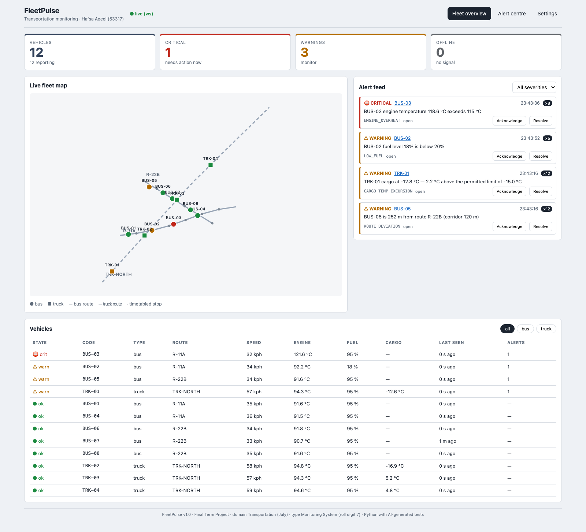
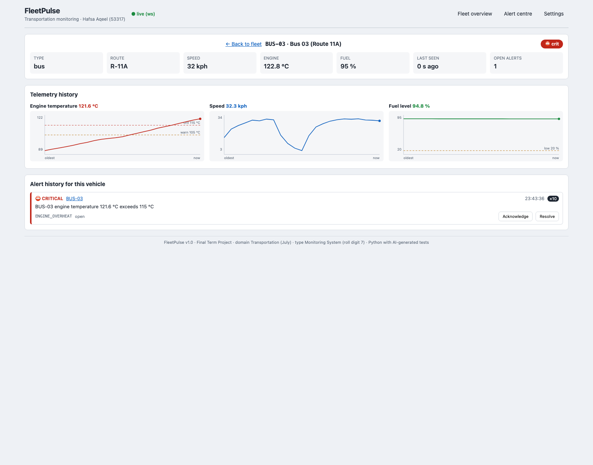
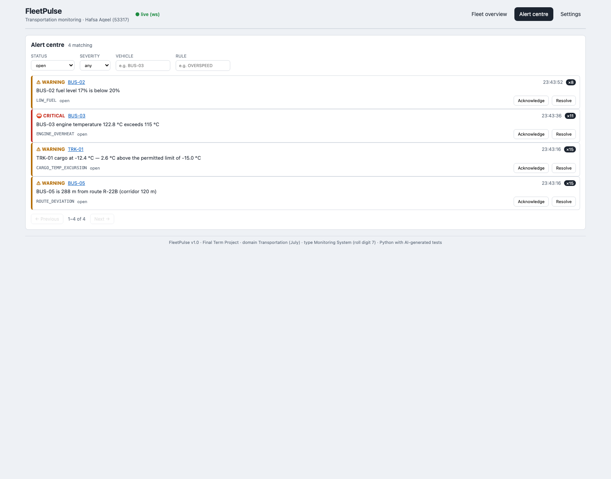
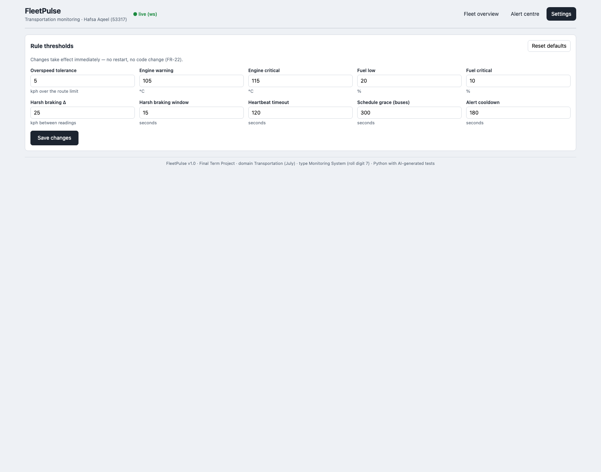

# Running FleetPulse in Docker

**Project:** FleetPulse · **Student:** Hafsa Aqeel (53317)
**Generated by AI prompt:** P-26 (see `PROMPT_LOG.md`), verified by building and running the stack.

The fastest way to verify the project on a machine that has nothing installed but Docker.
No Python, no Node, no database server.

---

## 1. One command

```bash
cd hafsa-gen-ai-final
docker compose --profile sim up --build
```

Then open **<http://localhost:8000>**.

That builds the image, starts the API with the dashboard served from the same origin, waits
for it to report healthy, seeds twelve vehicles on three routes, and starts a simulated
fleet with five faults armed.

Stop with `Ctrl+C`, or `docker compose --profile sim down`.

---

## 2. What each command does

| Command | Effect |
|---|---|
| `docker compose up --build` | API + dashboard only. Fleet registered but idle — everything reads `offline`. Useful for showing the empty state before turning telemetry on. |
| `docker compose --profile sim up --build` | The above **plus** the simulator with five faults armed. |
| `docker compose run --rm tests` | Runs the 290 AI-generated tests inside the image and exits. |
| `docker compose logs -f simulator` | Watch telemetry being posted, tick by tick. |
| `docker compose down` | Stop everything; the database volume survives. |
| `docker compose down -v` | Stop and **delete the database**, for a clean re-demo. |

---

## 3. Verifying it works

```bash
curl localhost:8000/api/health
curl localhost:8000/api/meta
curl "localhost:8000/api/alerts?limit=10"
curl localhost:8000/api/fleet/snapshot
open  localhost:8000/docs          # interactive Swagger UI
```

Alerts appear on this schedule once the simulator is running (5-second ticks):

| Elapsed | What appears |
|---|---|
| ~5 s | All twelve vehicles turn from `offline` to `ok` and start moving on the map |
| ~50 s | `ENGINE_OVERHEAT` **warning** on BUS-03 |
| ~60 s | `ROUTE_DEVIATION` on BUS-05, `CARGO_TEMP_EXCURSION` on TRK-01 |
| ~90 s | `ENGINE_OVERHEAT` escalates to **critical**; `LOW_FUEL` on BUS-02 |
| ~2.5 min | `VEHICLE_OFFLINE` on BUS-07, raised by the background sweeper |

### Verified run (6 August 2026)

After roughly three minutes, 226+ readings ingested:

```
critical open   BUS-07   VEHICLE_OFFLINE       x1    has not reported for 2.2 min (timeout 2.0 min)
critical open   BUS-03   ENGINE_OVERHEAT       x21   engine temperature 138.6 °C exceeds 115 °C
critical open   TRK-01   CARGO_TEMP_EXCURSION  x25   cargo at −10.1 °C — 4.9 °C above the limit of −15 °C
critical open   BUS-05   ROUTE_DEVIATION       x25   is 408 m from route R-22B (corridor 120 m)
warning  open   BUS-02   LOW_FUEL              x18   fuel level 14% is below 20%

counts: {total: 12, reporting: 11, ok: 7, warning: 1, critical: 3, offline: 1}
```

Five faults armed, five alerts — deduplicated from hundreds of readings, with BUS-03 having
escalated warning → critical inside the same alert row. The WebSocket was checked
separately: 58 `vehicle_update` frames and an `alert_raised` frame in one 25-second window,
so the dashboard is genuinely live rather than polling.

**Image size:** 239 MB · **Runtime memory:** ~59 MB (API) + ~43 MB (simulator).

### Screens (captured from the running container)

**Fleet overview** — KPI tiles, live SVG map, alert feed, worst-first vehicle table.



**Vehicle detail** — telemetry history with the thresholds drawn *on* the charts, so an
approaching failure is visible before it happens.



**Alert centre** — the full history with the FR-28 filters (status, severity, vehicle, rule).



**Settings** — every rule threshold, editable at runtime with no restart (FR-22).



---

## 4. Image structure

```
Stage 1  node:22-alpine   →  npm ci && npm run build   →  /build/dist
Stage 2  python:3.13-slim →  pip install -r requirements.txt
                             COPY --from=frontend /build/dist  →  /app/static
```

The Node toolchain never reaches the final image — only the ~170 kB of built assets. The
API then serves those assets itself, so the dashboard, the REST API and the WebSocket all
share one origin and CORS never applies.

That last point required one production change: `FLEETPULSE_SERVE_STATIC=1` (set in the
image) mounts the built SPA at `/`. It is opt-in rather than automatic so that local
development keeps using the Vite dev server with hot reload. When the SPA owns `/`, the
identity JSON moves to `/api/meta` — and the test suite forces the flag off so it asserts
the same behaviour on a laptop and in the container.

---

## 5. Services

| Service | Profile | Role |
|---|---|---|
| `api` | default | Uvicorn on `:8000`, serves the SPA, runs the offline sweeper |
| `simulator` | `sim` | Waits for the API to be healthy, then posts telemetry over HTTP |
| `tests` | `tools` | One-shot pytest run |

**Why the simulator shares the data volume.** It reads the registered fleet and route
polylines straight from the SQLite file, then posts telemetry back **over HTTP** — the same
ingestion path the dashboard depends on. It never writes readings directly; a back door
would prove nothing about the real path.

**Why `depends_on: service_healthy`.** The simulator would otherwise race the API's startup
and exit on a connection refusal. The entrypoint also polls `/api/health` for up to 60 s as
a second guard, then fails loudly rather than hanging.

**Seeding is idempotent.** The `api` entrypoint runs `python -m app.seed` (no `--reset`),
which does nothing when data already exists — so restarting the container mid-demo does not
wipe the alerts you just raised.

---

## 6. Customising the demo

Change which faults are armed by editing the `command:` list under `simulator` in
`docker-compose.yml`, or run a one-off:

```bash
docker compose run --rm simulator simulator \
  --interval=2 --scenario=BUS-01=overheat --scenario=TRK-02=cargo_spike
```

Scenarios: `overheat`, `fuel_drain`, `deviation`, `dropout`, `cargo_spike`, `none`.

Reseed from scratch without rebuilding:

```bash
docker compose down -v && docker compose --profile sim up
```

Open a shell inside the running container:

```bash
docker compose exec api sh
python -m app.seed --reset
```

Every environment variable in `docs/07-installation-guide.md` §8 works here too — add them
under `environment:` in `docker-compose.yml`.

---

## 7. Troubleshooting

| Symptom | Cause | Fix |
|---|---|---|
| `bind: address already in use` | Port 8000 taken | Change the mapping to `"8080:8000"` and use `localhost:8080` |
| Dashboard loads but nothing moves | Simulator not started | Use `--profile sim`, or `docker compose logs simulator` |
| `ERROR: … did not become healthy within 60s` | API failed to start | `docker compose logs api` |
| Every bus shows `SCHEDULE_DELAY` immediately | Stale volume from an older build | `docker compose down -v` then up again |
| Build fails at `npm ci` | `package-lock.json` out of sync | `cd frontend && npm install`, commit the lockfile, rebuild |
| Alerts persist across a restart | Intended — the volume survives | `docker compose down -v` for a clean slate |
